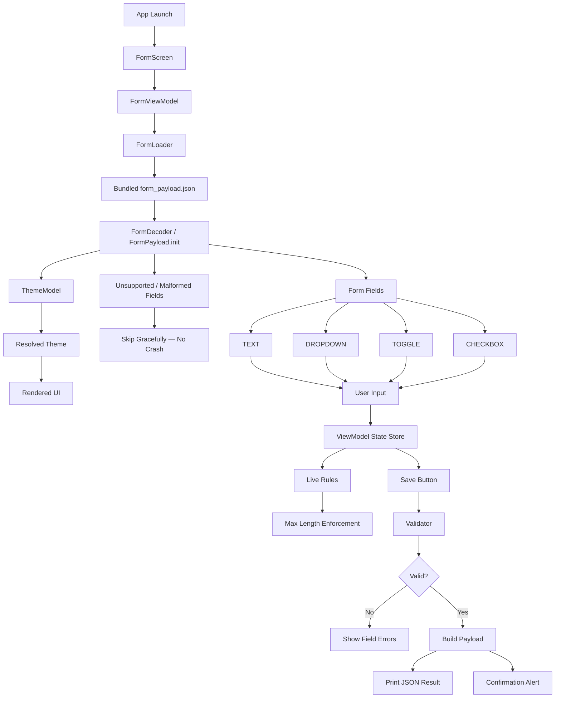

# Eulerity — Project Flow

> A single-screen, fully-offline SwiftUI app whose entire UI is rendered from a **bundled JSON
> payload** (`Resources/form_payload.json`). It parses a polymorphic field list, applies a
> JSON-defined theme, collects input with live + on-save validation, and prints / alerts the
> resulting key-value payload — **never crashing** on malformed or unknown input.

This document explains how data and control move through the app, layer by layer, from launch
to submission. It is written to match the project's flow diagram and the actual code in
`Eulerity/`.

---

## 1. The big picture

The app is **server-driven UI** with no server: a JSON document *describes* the form, and the
app *renders* whatever it describes. Nothing about the fields is hard-coded — add a field to the
JSON and it appears; send an unknown field type and it is quietly skipped.

Architecture is strict, one-directional **MVVM** (Constitution I):

```
Views  ──▶  ViewModel  ──▶  Models / Parsing / Validation / Theming(model side)
(SwiftUI)   (@MainActor,        (pure, Sendable, NO import SwiftUI)
            @Published state)
```

- **Views** are declarative only — they observe state and send intents.
- The **ViewModel** owns all mutable state via `@Published` and exposes intent methods.
- **Models / Parsing / Validation** are pure value types, `Sendable`, and import **no SwiftUI**.
- The **only** SwiftUI/UIKit seam below the view layer is `ResolvedTheme` (the presentation
  side of theming) — everything model-side (`ThemeModel`, `HexColorParser`) stays pure.

Two cross-cutting principles drive almost every design choice:

- **Never crash (Constitution V):** no force-unwraps / `try!` on JSON paths. Bad data degrades
  gracefully instead of throwing up the stack.
- **Big-O discipline (Constitution IV):** every function carries a complexity comment; lookups
  use pre-built `[id: …]` maps / `Set`s, never nested scans.

---

## 2. End-to-end flow



The sections below walk each stage.

---

## 3. Stage-by-stage

### 3.1 Launch → Screen

| Step | File | What happens |
|------|------|--------------|
| App Launch | `App/EulerityApp.swift` | `@main` app; its only scene is `FormScreen()`. The composition root — no networking layer exists by design. |
| Screen | `Views/FormScreen.swift` | Holds `@State loadState: ViewState<FormPayload>`. On `.onAppear` it loads the payload once (guards on `.idle`). Delegates rendering to `StateView`. |

`FormScreen` renders one of three things through `StateView` (`Views/Support/StateView.swift`):

- `.idle` / `.loading` → a `ProgressView`
- `.loaded(payload)` → `FormContentView(payload:)`
- `.failed(message)` → a friendly error card (icon + message, optional Retry)

This is the **load-state machine** (`Support/ViewState.swift`) — a single finite-state enum so
"loading", "loaded", and "failed" can never be expressed as an impossible combination.

### 3.2 Load → Decode (parsing the JSON)

```
FormScreen.loadIfNeeded()
   └─▶ FormLoader.load(resource: "form_payload")   // Parsing/FormLoader.swift
          ├─ bundle.url(...)  missing → .failure(.fileNotFound)
          ├─ Data(contentsOf:) throws → .failure(.unreadable)
          └─ FormLoader.decode(data)
                 └─ JSONDecoder().decode(FormPayload.self)  throws → .failure(.decoding)
```

`FormLoader` returns a typed **`Result<FormPayload, FormLoadError>`** rather than throwing
(`Parsing/FormLoadError.swift` is a closed set of failure cases that conform to
`LocalizedError`). `FormScreen` maps a `.failure` straight to `.failed(errorDescription)`, so a
missing / unreadable / corrupt file produces a polished message instead of a crash.

**Decoding is defensive at three levels** (`Models/FormPayload.swift`, `Models/FormField.swift`):

1. **Top-level shape** — `FormPayload.init(from:)` decodes `form_title`, optional `theme`, and
   `fields`. A truly corrupt top-level shape (e.g. `fields` isn't an array) throws and is caught
   by `FormLoader` → friendly error.
2. **Per-element resilience** — each field is wrapped in `Failable<FormField>`: a decode failure
   becomes `nil` instead of aborting the whole array, so **one malformed field is skipped and
   the rest survive**.
3. **Per-field tolerance** — `FormField.init(from:)` requires only `id`, `type`, `label`
   (a field lacking these is unusable → throws → skipped upstream). Every other key is optional
   and tolerant of the wrong JSON type: missing/garbage `order` → `Int.max` (renders last),
   wrong-typed `placeholder`/`max_length`/etc. → `nil`/default, never a thrown field.

After decoding, `FormPayload.fields` keeps only elements that **decoded successfully AND are a
supported type**. Unknown types (e.g. `"COLOR_PICKER"`) decode to `FieldType.unsupported` and are
filtered out; the count of everything dropped is recorded in `skippedFieldCount` for diagnostics.

> **Polymorphic-but-flat model:** `FormField` is one flat struct holding every possible
> type-specific key, plus a computed `kind: FieldKind` that exposes only the keys relevant to its
> `type`. Views and the view model switch over `kind` instead of re-inspecting raw optionals.
> During decode, a dropdown's `id → label` map (`optionLabelsByID`) is pre-built once for O(1)
> label resolution later.

### 3.3 Theme resolution (the left branch)

| Model side (pure) | Presentation side (SwiftUI) |
|-------------------|------------------------------|
| `Models/ThemeModel.swift` — raw optional hex strings (`background_color`, `text_color`, `border_color`, `error_color`) exactly as in JSON. | `Theming/ResolvedTheme.swift` — turns each channel into a SwiftUI `Color`, **falling back per channel** to an adaptive system color when the hex is missing or invalid. |
| `Theming/HexColorParser.swift` — parses `#RGB`, `#RRGGBB`, `#RRGGBBAA` (with/without `#`). Any malformed input → `nil` (never a crash). O(1), input is bounded. | Also exposes derived colors: `accent` (fixed brand `#BB86FC` for active states), `placeholder`, and `surface`. |

So a theme block with all-invalid hex resolves entirely to `ResolvedTheme.fallback` and the form
stays legible. `ResolvedTheme` is the **only** theming type that imports SwiftUI/UIKit.

### 3.4 Build the ViewModel

`FormContentView` (`Views/FormContentView.swift`) owns the form. In its `init(payload:)` it:

- creates the `FormViewModel(payload:)` as a `@StateObject`, and
- resolves `ResolvedTheme(model: payload.theme)` once for painting.

`FormViewModel.init` (`ViewModels/FormViewModel.swift`, `@MainActor`, `ObservableObject`)
performs the one-time setup:

1. **Sort fields** by the `order` integer with an explicit, stable tie-break on decode index
   (`sorted`, O(n log n)) → `orderedFields`. Equal orders keep payload sequence; missing order
   (`Int.max`) renders last. **Never** sorted by array index.
2. **Build `fieldsByID`** — an `[id: FormField]` map for O(1) metadata lookups during edits.
3. **Compile regexes once** (`compileRegexes`) into `[id: NSRegularExpression]`; invalid patterns
   are dropped (treated as "no rule") so validation never recompiles or crashes.
4. **Seed initial values** (`seedValues` → `initialValue`):
   - TEXT: `default_value` string, **truncated to `max_length`** on seed.
   - TOGGLE / CHECKBOX: `default_value` bool (else `false`).
   - DROPDOWN: `default_values` (or a single `default_value`) **filtered to ids that actually
     exist** in the options (ghost ids dropped) via a `Set`.

State the views observe:

- `@Published values: [String: FieldValue]` — the live value of every field.
- `@Published errors: [String: String]` — populated on Save (empty == valid).
- `@Published confirmation: Confirmation?` — set on a successful submit; drives the alert.

### 3.5 Render the fields (the middle branch)

`FormContentView` lays out a `NavigationStack` → `ScrollView` → `VStack`, iterating
`viewModel.orderedFields` into one `FieldRowView` each, followed by the **Save** button. The
title is a themed `principal` toolbar item; the background uses `theme.background`.

`FieldRowView` (`Views/FieldRowView.swift`) is the router: it shows the label (for text /
dropdown — toggle and checkbox carry their own inline label), the control for the field's
`kind`, and any `errors[field.id]` message in `theme.error`. Routing per `kind`:

| `kind` | Component | Notes |
|--------|-----------|-------|
| `.text(subtype)` | `TextFieldComponent` | Routes the 5 subtypes (PLAIN, MULTILINE, NUMBER, URI, SECURE) to the right keyboard/affordance. Shows a `CharacterCounterView` when `max_length` is set. |
| `.dropdown` (has options) | `DropdownComponent` | Single- or multi-select; shows `label`, stores `id`. |
| `.dropdown` (empty options) | `BillingAccountComponent` | A required dropdown with no preset options becomes the local **add-a-billing-card** flow. |
| `.toggle` | `ToggleComponent` | Inline label + switch. |
| `.checkbox` | `CheckboxComponent` | Inline (rich-text) label + checkmark. |
| `.unsupported` | `EmptyView()` | Defensive; renderable fields never reach this. |

Two notable view-side behaviours:

- **Rich-text checkbox labels** (`Support/RichTextLabel.swift`): each `metadata` key found as a
  substring of the label becomes a tappable link to its URL. Keys not found, or malformed /
  scheme-less URLs, are left as plain text. Pure Foundation; the link *color* is applied by the
  view via `.tint`.
- **Billing-account flow** (`Views/Components/BillingAccountComponent.swift` +
  `Persistence/CardStore.swift`): tapping opens a bottom sheet to add a card; cards persist in
  `UserDefaults` (observable `CardStore`). The chosen card's id is stored as the field's
  selection, so validation/submit treat it like any dropdown option.

### 3.6 User input → state store

Views never mutate state directly — they call **intent methods** on the view model, which update
`values`:

| Intent | What it does | Complexity |
|--------|--------------|------------|
| `updateText(_:to:)` | Sets a text value, enforcing `max_length` **live** by truncating the prefix. | O(L) |
| `toggle(_:)` | Flips a toggle / checkbox bool. | O(1) |
| `select(_:optionID:)` | Single-select replaces; multi-select toggles membership. | O(s) |

> **Live `max_length` is enforced twice:** `TextFieldComponent` hard-caps its local `@State`
> (rewriting an over-limit edit so the extra character is dropped on screen), *and*
> `updateText` truncates again so the view model never holds an over-limit value. The character
> counter reflects the capped length.

### 3.7 Validation (the two-timing model)

| Timing | Rule | Where |
|--------|------|-------|
| **Live (at input)** | `max_length` | `TextFieldComponent` + `updateText` (truncate). |
| **On Save** | `required`, `regex`, empty-selection conflicts, `max_length` re-check | `Validation/Validator.swift`. |

`Validator.validate(fields:values:regexes:)` is **pure** and SwiftUI-free: it returns
`[fieldId: errorMessage]`; an empty dictionary means valid. Per `kind`:

- **TEXT** — required & empty → required message; over `max_length` → length message; non-empty
  value failing `regex` → `error_message` (or a default). An invalid regex pattern is treated as
  "no rule" and never blocks submit.
- **CHECKBOX** — required & not on → required message.
- **DROPDOWN** — required & empty selection → required message (this is how an empty-options
  required dropdown stays blocked until a card is added).
- **TOGGLE / unsupported** — always valid.

The same validation drives `isFormValid` (a computed property), which colors the Save button
`theme.accent` when the form is ready and `theme.border` otherwise.

### 3.8 Save → decision → output (the bottom branch)

`validateAndSubmit()` is the terminal flow:

```
errors = Validator.validate(...)         // recompute against current values
   ├─ errors not empty  ──▶ confirmation = nil; surface errors under each field   (No)
   └─ errors empty                                                                 (Yes)
          payload = submissionPayload()   // [String: SubmitValue]
          json    = prettyJSON(payload)   // sorted-keys, pretty-printed
          print(json)                     // ← the spec'd "print the result" behaviour
          confirmation = Confirmation(payload, json)  // ← drives the alert
```

`submissionPayload()` (`SubmitValue`, `Models/SubmitValue.swift`) preserves the
**scalar-vs-array** distinction (the brief's requirement):

- TEXT → `.string` (empty text is **omitted**).
- single-select DROPDOWN → `.string(id)`; multi-select → `.strings([ids])` (empty selection
  omitted).
- TOGGLE / CHECKBOX → `.bool`.

`prettyJSON` serializes via `JSONSerialization` with `.sortedKeys` + `.prettyPrinted`, guarding
with `isValidJSONObject` and returning `"{}"` on any failure (never a crash). The confirmation
alert (`FormContentView`) shows the JSON; dismissing it clears `confirmation` via
`dismissConfirmation()`.

---

## 4. Resilience model (why it never crashes)

| Bad input | Behaviour | Owner |
|-----------|-----------|-------|
| Missing / unreadable / corrupt JSON file | Friendly `.failed` screen | `FormLoader` → `FormScreen` |
| One malformed field element | That element skipped; rest render | `Failable<FormField>` |
| Field missing `id` / `type` / `label` | That field skipped | `FormField.init` (throws) + `Failable` |
| Unknown field `type` | Excluded from render, counted | `FieldType.unsupported` + `FormPayload` filter |
| Unknown text `subtype` | Falls back to `.plain` | `TextSubtype.init` |
| Wrong-typed optional key (e.g. `order` = `"oops"`) | Safe default (`order` → `Int.max`) | `FormField.init` |
| Invalid / missing hex color | Per-channel system fallback | `HexColorParser` + `ResolvedTheme` |
| Invalid `regex` pattern | Treated as "no rule" | `compileRegexes` + `Validator.matches` |
| Ghost default-selection ids | Filtered out at seed | `initialValue` |
| Non-serializable submit payload | Returns `"{}"` | `prettyJSON` |

No force-unwraps or `try!` exist on any JSON path.

---

## 5. Layer / file map

```
Eulerity/
├── App/
│   └── EulerityApp.swift          @main → FormScreen (composition root)
├── Resources/
│   └── form_payload.json          the bundled payload that drives the whole UI
├── Models/                        pure, Sendable, NO SwiftUI
│   ├── FormPayload.swift          top-level decode + per-element resilience (Failable)
│   ├── FormField.swift            flat polymorphic field + computed `kind`
│   ├── FieldType.swift            TEXT/DROPDOWN/TOGGLE/CHECKBOX/unsupported
│   ├── FieldValue.swift           live value: .text / .bool / .selection
│   ├── TextSubtype.swift          PLAIN/MULTILINE/NUMBER/URI/SECURE (unknown → plain)
│   ├── DropdownOption.swift       { id, label }
│   ├── ThemeModel.swift           raw optional hex strings
│   ├── SubmitValue.swift          typed submit payload value (.string/.bool/.strings)
│   └── BillingCard.swift          locally-added card model
├── Parsing/
│   ├── FormLoader.swift           bundle load + decode → Result
│   └── FormLoadError.swift        typed, localized failure set
├── Theming/
│   ├── HexColorParser.swift       hex → RGBA (pure, nil on bad input)
│   └── ResolvedTheme.swift        RGBA → SwiftUI Color (the presentation seam)
├── Validation/
│   └── Validator.swift            on-Save rules → [fieldId: message]
├── Persistence/
│   └── CardStore.swift            billing cards in UserDefaults (observable)
├── Support/
│   ├── ViewState.swift            idle/loading/loaded/failed
│   └── RichTextLabel.swift        metadata-link attributed labels
├── ViewModels/
│   └── FormViewModel.swift        @MainActor state owner + intents + submit
└── Views/
    ├── FormScreen.swift           load-state host
    ├── FormContentView.swift      themed form, owns the view model, Save + alert
    ├── FieldRowView.swift         routes a field's `kind` to its component
    ├── Components/
    │   ├── TextFieldComponent.swift
    │   ├── DropdownComponent.swift
    │   ├── ToggleComponent.swift
    │   ├── CheckboxComponent.swift
    │   └── BillingAccountComponent.swift
    └── Support/
        ├── StateView.swift            renders a ViewState
        ├── CharacterCounterView.swift max_length counter
        └── ThemedFieldStyle.swift     shared themed field chrome (.themedField)
```

---

## 6. One-paragraph summary

On launch, `FormScreen` asks `FormLoader` to read and decode the bundled `form_payload.json` into
a `FormPayload`, mapping any failure to a friendly error state. Decoding is defensive at every
level, so malformed fields and unknown types are skipped rather than fatal. The successful
payload builds a `FormViewModel` (sorted fields, pre-built id maps, compiled regexes, seeded
defaults) and a `ResolvedTheme` (hex → safe SwiftUI colors). `FormContentView` renders each field
through `FieldRowView` into the right themed component; user edits flow back as view-model intents
that update `values`, with `max_length` enforced live. On **Save**, the pure `Validator` checks
required / regex / conflict rules: failures populate per-field `errors`, while success builds a
typed `SubmitValue` payload, prints its pretty JSON, and shows a confirmation alert — all without
ever crashing.
